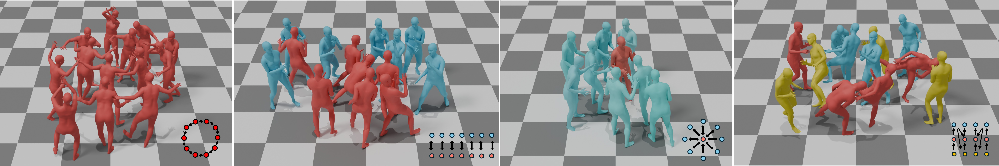

<div align="center">
<h1 align="center">Multi-Person Interaction Generation from Two-Person Motion Priors</h1>
<h3 align="center">SIGGRAPH 2025 Conference Proceedings</h3>
  <a href='https://wenningxu.github.io/multicharacter/'></a> <a href='https://arxiv.org/abs/2505.17860'></a>
</div>
<p align="center">
  
</p>

## Getting started

This code was tested on `Ubuntu 20.04.1 LTS` and requires:

* Python 3.8
* conda3 or miniconda3
* CUDA capable GPU (one is enough)

### 1. Setup environment

```shell
conda create --name intergen
conda activate intergen
pip install -r requirements.txt
```

### 2. Get data


Download the data from [webpage](https://tr3e.github.io/intergen-page/). And put them into ./data/.


### 3. Download the checkpoint
Run the shell script:

```shell
./prepare/download_pretrain_model.sh
```
## Generate Multi-person Interactions

### 1. Modify the configs and pair-wise interaction graph
Modify config files ./configs/model.yaml and graph structure you want in ./configs/infer.yaml. 
For example, you can change the `INTER_GRAPH` field in `infer.yaml` to:

```yamlgraph:
INTER_GRAPH:
  IN: [[1, 2], [0], [0]]
  OUT: [[1, 2], [0], [0]]
```
Which is a 2 vs 1 scene, where character 0 interacts with character 1 and 2.

### 2. Modify the input file ./prompts.txt like:

```sh
People attack each other with their punch.
They initiate a dance routine that involves swaying shoulders and arms.
People are blaming each other and having an intense argument.
They engage in a fierce boxing match, with aggressively exchanging blows while also defending themselves.
People are playing a game of tossing and catching a toy duck.
...
```

### 3. Run
```shell
python tools/infer_multi.py
```
The results will be plotted and put in ./results/


## Extend to other two-person diffusion model
Please read the paper and [sample function](https://github.com/wenningxu/multi-person-interaction/blob/master/models/gaussian_diffusion.py#L1696).

## TODOs
- [ ] Release the time-varying sampling process.

- [X] Release the multi-person sampling code.

## Citation

If you find our work useful in your research, please consider citing:

```
@inproceedings{Xu2025,
  series = {SIGGRAPH Conference Papers ’25},
  title = {Multi-Person Interaction Generation from Two-Person Motion Priors},
  url = {http://dx.doi.org/10.1145/3721238.3730688},
  DOI = {10.1145/3721238.3730688},
  booktitle = {Proceedings of the Special Interest Group on Computer Graphics and Interactive Techniques Conference Conference Papers},
  publisher = {ACM},
  author = {Xu,  Wenning and Fan,  Shiyu and Henderson,  Paul and Ho,  Edmond S. L.},
  year = {2025},
  month = aug,
  pages = {1–11},
  collection = {SIGGRAPH Conference Papers ’25}
}
```


## Acknowledgments
This code is derived from [InterGen](https://tr3e.github.io/intergen-page/).
